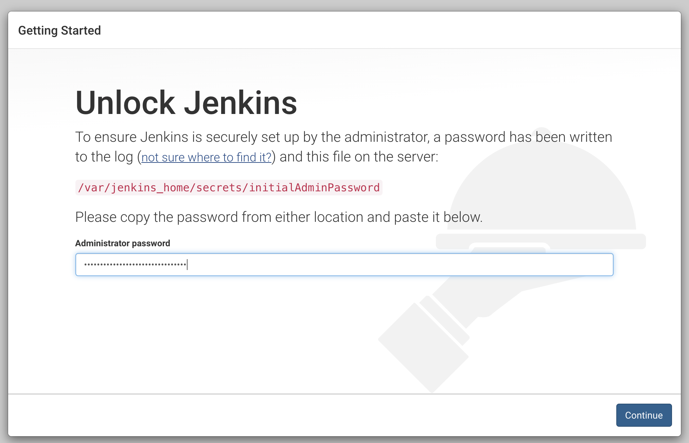
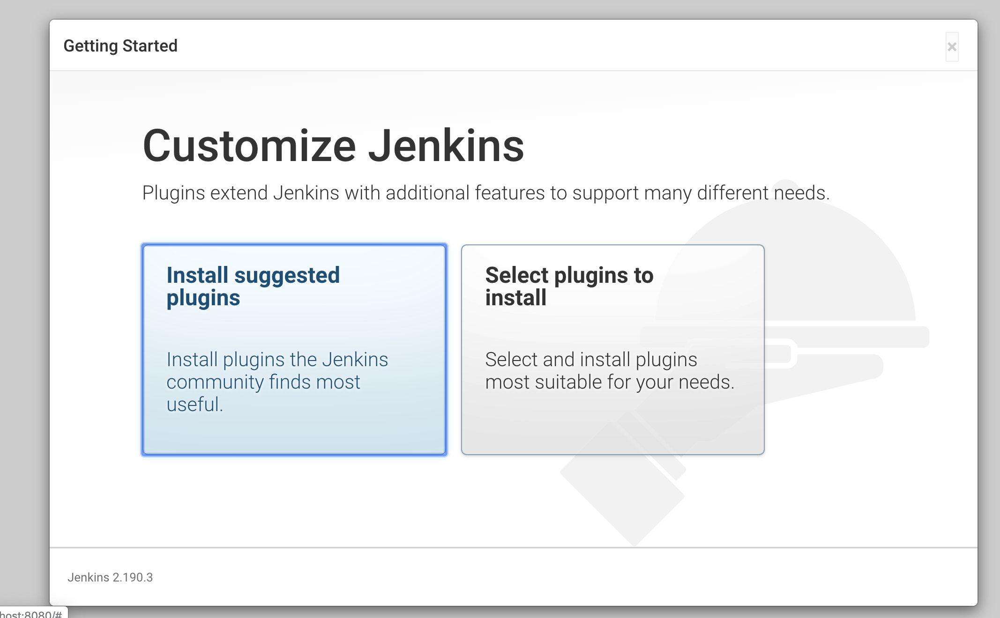
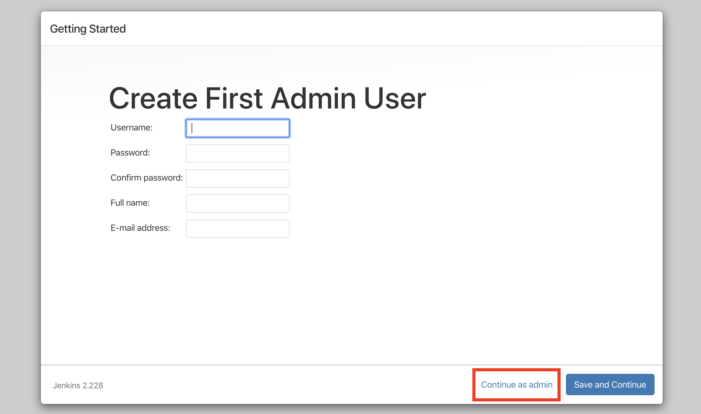
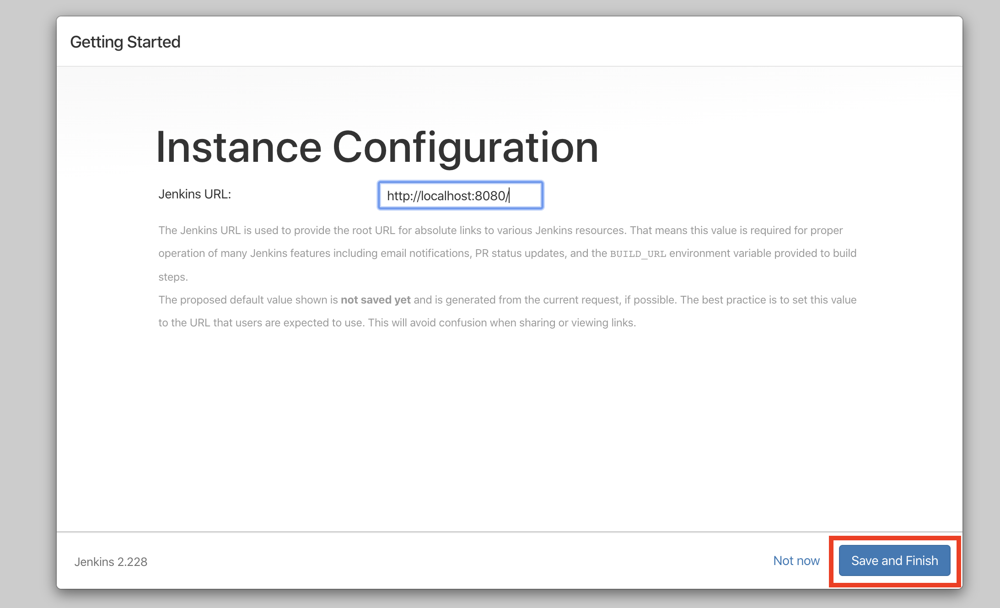

# sample-deploy-pipeline

Jenkins, docker and docker-compose in a container for building and deploying projects.

## Instructions

### getting started

You will need to source the file `SOURCEME.sh`.

For example:

```bash
source SOURCEME.sh
```

To start the Jenkins container, enter `appsec_start`.

Once complete, you will see the Jenkins admin password to log into the Jenkins server.


### Logging in

The Jenkins web server is on `localhost:8080` You will see the following page.



The admin password is _as described above_ or can be obtained by running `appsec_get_jenkins_admin_creds`.

Install the recommended plugins



You will then see the plugins being installed.


Select 'Continue as admin'.



Select 'Save and Finish'.



Select 'Start using Jenkins'.


Jenkins should now be setup.


### Building the pipeline

Select 'New item', enter the name 'AppSec 101' for the project, select 'Feestyle project' and click 'OK'


- Select source code management: git and enter the HTTPS URL of your fork of the `sample-flask-app` repository
- Under the heading 'Build' select 'Add build step' > 'Execute shell'
  In the 'Command' box enter: `docker-compose down; docker-compose up -d; sleep 10; docker-compose logs`
- Save
- Build Now
- On the command line on your host machine, enter `docker ps` and you will see the app running.
- In the browser, browse to 'localhost:8000' to see your app.

This will execute the flask app on the jenkins server.

## Additional Notes

### To get a terminal on the jenkins container

```bash
appsec_get_jenkins_shell
```

### remove jenkins-docker image (to clean up when we're done)

```bash
appsec_cleanup
```

### Jenkins working directory

You can find the working directory at `/var/jenkins_home/workspace/`.
